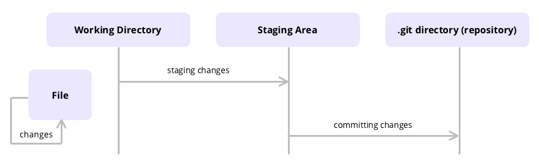

# Git

## Contents

* [System Setup](#system-setup)
* [Concepts](#concepts)
  * Branching
  * Forks
* [Commands Reference](#commands-reference)
* [GitHub Pages](#github-pages)
---

Git can keep track of changes made to code, synchronize code between different people, test changes to code without losing the original, and revert back to old versions of code.

GitHub is a website that stores Git repositories on the internet to facilitate the collaboration that Git allows for. A repository is simply a place to keep track of code and all the changes to code.



## System Setup

Set username and email
```Shell
$ git config --global user.name "<name>"
$ git config --global user.email your.name@email.com
```

Save credentials
```Shell
$ git config credential.helper store
```

## Concepts

Any version of a repository that is not stored locally on a device is called a **remote**. **Origin** is used to refer to the remote from which the local repository was originally downloaded from.

### Branching
**Branching** is a feature of Git that allows a project to move in multiple different directions simultaneously. There is one *master* branch that is always usable, but any number of new branches can be created to develop new features. Once ready, these branches can then be merged back into *master*.

When working in a Git repository, *HEAD* refers to the current branch being worked on. When a different branch is "checked out", the *HEAD* changes to indicate the new working branch.

When merging a branch back into *master*, there is the possibility for merge conflicts to arise. These conflicts thousl be resolved before being able to merge the branch.

### Forks
A **fork** of a repository is an entirely separate repository which is a copy of the original repository. A forked repository can be managed and modified like any other, all without affecting the original copy.

Open source projects are often developed using forks. There will be one central version of the software which contributors will fork and improve on, and when they want these changes to be merged into the central repository, they submit a ‘pull request’.

A pull request can be made to merge a branch of a repository with another branch of the same repository or even a different repository. Pull requests are a good way to get feedback on changes from collaborators on the same project. Note that forks and pull requests are both GitHub specific features.

### Ignoring files
Create a .gitignore file. It should include all files and directories that won't be tracked for changes
```shell
$ echo "<filename(s)>" >> .gitignore
```

## Commands Reference

* `git clone <url>` take a repository stored on a server (like GitHub) and downloads it
* `git init .` initialize the current directory as a new repository
* `git add <filename(s)>` add files to the staging area to be included in the next commit
* `git add -A` add all project files to the staging area to be included in the next commit
* `git commit -m "message"` take a snapshot of the repository and save it with a message about the changes
* `git commit -am "message"` add and commit all changed files all in one
* `git status` print what is currently going on with the repository
* `git push` push any local changes (commits) to a remote server
* `git pull` pull any remote changes from a remote server to a local computer. Equivalent to running `git fetch` and then `git merge origin/master`
* `git fetch` download all of the latest commits from a remote to a local device
* `git log` print a history of all the commits that have been made
* `git reflog` print a list of all the different references to commits
* `git reset --hard <commit>` reset the repository to commit *commit*
* `git reset --hard origin/master` reset the repository to its original state (e.g. the version cloned from GitHub)
* `git rm -r --cached <filename(s)>` remove files that were set to be included in the repository and shouldn't be
* `git branch` list all branches currently in a repository
* `git branch <name>` create a new branch called *name*
* `git branch -d <name>` delete branch called *name*
* `git checkout <name>` switch current working branh to *name*
* `git checkout -b <name>` create a new branch called *name* and switch to that branch
* `git checkout master` switch to branch *master*
* `git merge <name>` merge branch *name* into current working branch (normally *master*)
* `git merge origin/master` merge *origin/master*, which is the remote version of a repository normally downloaded with git fetch, into the local, preexisting *master* branch

## GitHub Pages

GitHub Pages is a feature of GitHub which allows for a repository to be deployed to the internet.

* Simply scroll to GitHub Pages under Settings, select the master branch, and click save.
* By default, the repository will be deployed to username.github.io/repository.
* GitHub Pages is automatically updated when the repository is updated.
