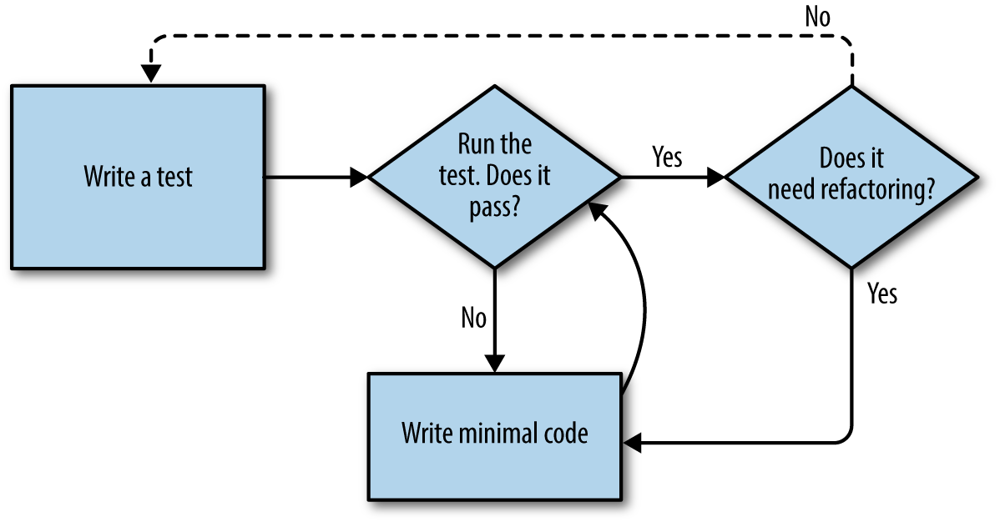

# Python 3

<div align="right">

[↤ back to Home](README.md)

</div>

## Contents

* [Test-Driven Development (TDD)](#test-driven-development-tdd)
  * Terminology
  * Red/Green/Refactor and Triangulation
* [Logging](#logging)
---
<br>

## Test-Driven Development (TDD)

In TDD the first step is always the same: _write a test_.

_First_ write the test; _then_ run it and check that it fails as expected. _Only then_ go ahead and build some of the app.

TDD is a _discipline_, and that means it's not something that comes naturally; because many of the payoffs aren't immediate but only come in the longer term, you have to force yourself to do it in the moment.

### Terminology
__Functional tests__ may be called _acceptance tests_ or _end-to-end tests_ and they look at how the whole application functions, from the outside. Another term is _black box test_, because the test doesn't know anything about the internals  of the system under test.

Functional tests can be a sort of specification for the application. It tends to track what might be called a _User story_, and follows how the user might work with a particular feature and how the app should respond to them. They have a human-readable story that can be followed and it's made explicit by using comments that accompany the test code.

__Unit tests__ test the application from the inside, from the point of view of the programmer.

#### Workflow
1. Write a _functional test_ describing the new functionality from the user's point of view
2. Once you have a functional test that fails, start to think about how to write code that can get it to pass. Then you use one or more _unit tests_ to define how you want the code to behave. Each line of production code you write should be tested by (at least) one your unit tests
3. Once you have a failing unit test, you write the smallest amount of _application code_ you can, just enough to get the unit test to pass. You may iterate between steps 2 and 3 a few times, until you think the functional test will get a little further.
4. Rerun the functional test and see if it pass, or get a little further. That may prompt you to write some new unit tests, and some new code, and so on.



The functional tests drive development from a high level, while unit tests drive at a low level.


> Functional tests should help you build an application with the right functionality, and guarantee you never accidentally break it. Unit tests should help you to write code that's clean and bug free.

### Red/Green/Refactor and Triangulation
The unit-test/code cycle is usually taught as _Red, Green, Refactor:_
* Start by writing a unit test which fails (_Red_).
* Write the simplest possible code to get it to pass (_Green_), _even if that means cheating_.
* _Refactor_ to get to better code that makes more sense.

#### Refactoring stage
* _Eliminate duplication:_ if your test uses a magic constant, and your application code also uses it, that counts as duplication, so it justifies refactoring. Removing the magic constant from the application code usually means you have to stop cheating.
* _Triangulation:_ if your test lets you get away with writing "cheating" code that you're not comfortable with, _write another test_ that forces you to write some better code.

<div align="right">

[↥ back to top](#python-3)

</div>
<br>

## Logging

Python provides logging through the ```logging``` module. It can be used in two broad ways and both share the same principles:
* __Basic interface__: simple to set up, useful for scripts and mid-size applications
* __Logger objects__: complex to set up, far more powerful. Scales to any size

### Basic Interface
###### Usage
```Python
import logging
logging.warning('Watch out!')
logging.error('Watch out!')
```
###### Output
```Shell
$ WARNING:root:Watch Out!
$ ERROR:root:Watch Out!
```

#### Configuring the Basic Interface
The `logging.basicConfig()` method has to be called exactly once and it must happen before the first logging event. Additionally if the program has several threads, it must be called from the main thread and *only* the main thread.

##### Basic Arguments
* __level__: the log level threshold
* __format__: the format of the log records
* __filename__: filename to write log messages, by default writes to stderr
* __filemode__: "a" to append to the log file (default), "w" to overwrite

###### Log Level signals
The following are the log level signals supported by the `logging` module from lowest to highest severity. The order matters in the list below; _debug_ is considered strictly less severe than _info_, and so on.

* __debug__: detailed information, should be used when diagnosing problems (shouldn't be used in production)
* __info__: confirmation that everything is working as expected (might be used in production depending on the application)
* __warning__: something unexpected happened or a potential problem in the near future (eg. filesystem full)
* __error__: the application has not been able to perform a function
* __critical__: a serious error, the application is unable to continue running

Each level has a corresponding uppercased constant in the library (e.g., `logging.WARNING` for `logging.warning()`) and are used when defining the log level threshold. The default is `logging.WARNING` and it it can be changed with `logging.basicConfig(level=logging.INFO)`.

The phrase _log level_ has two different meanings depending on the context. It can mean the __severity__ of the message, which can be set by choosing which of the methods to use (e.g., `logging.warning()`). Or it can mean the __threshold__ for ignoring a message which is signaled by the constants (e.g., `logging.WARNING`).

Constants can also be used in the more general `logging.log` method
```Python
logging.log(logging.DEBUG, 'Small detail, useful for troubleshooting')
```
This is useful to modify the log level dynamically at runtime:
```Python
def log_results(message, level=logging.INFO):
    logging.log(level, 'Results: ' + message)
```

###### Format Attributes
Named fields are defined in percent-formatting by %(FIELDNAME)x, where "x" is a type code: _s_ for string, _d_ for integer (decimal), and _f_ for floating-point.
The default is `%(levelname)s:%(name)s:%(message)s` where name is the name of the logger object (by default *root*).

Some of the most common attributes:

Attribute | Format        | Description
--------- | ------------- | -----------
asctime   | %(asctime)s   | Human-readable date/time
funcName  | %(funcName)s  | Name of function containing the logging call
lineno    | %(lineno)s    | The line number of the logging call
message   | %(message)s   | The log message
pathname  | %(pathname)s  | Full pathname of the source file of the logging call
levelname | %(levelname)s | Text logging level for the message ('DEBUG', 'INFO', 'WARNING', 'ERROR', 'CRITICAL')
name      | %(name)s      | The logger's name

Full list can be found [here](https://docs.python.org/3/library/logging.html#logrecord-attributes)

__Note__: if the log level threshold is higher than the message itself, the line does nothing. Having this into consideration it's important to consider avoiding formatting the string passed to the logger object in order to avoid using system memory and CPU cycles when no logging will take place.

#### Implementation Example
```Shell
$ export MODE=development
```
```Python
import os
mode = os.environ.get('MODE', 'production').upper()

log_file = 'myapp.log'

# mode can be set by environment variable, command line option etc.
if mode === 'DEVELOPMENT':
    log_level = logging.DEBUG
    log_mode = 'w'
else:
    log_level = logging.WARNING
    log_mode = 'a'

logging.basicConfig(level = log_level, filename = log_file, filemode = log_mode)
```

### Logger Objects
Larger Python applications tend to have different logging needs. `logging` meets these needs through a richer interface, called _logger objects_ or simplu _loggers_.

When a call to `logging.warning()` (or other log method) is made, they convey messages through what is called the _root logger_, the primary, default logger object.

`logging.basicConfig` operates on this root logger and the actual root logger object can be fetch by calling `logging.getLogger()`
```Python
logger = logging.getLogger()
logger.name
```
```Shell
> 'root'
```

Logger objects have all the same methods the logging module itself has:
```Python
import logging
logger = logging.getLogger()
logger.debug('Small detail. Useful for troubleshooting.')
logger.info('This is informative.')
logger.warning('This is a warning message.')
logger.error('Uh oh. Something went wrong.')
logger.critical('We have a big problem!')
```

<div align="right">

[↥ back to top](#python-3)

</div>
<br>
